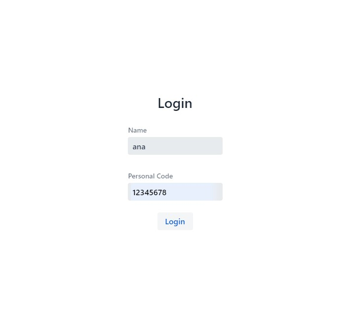
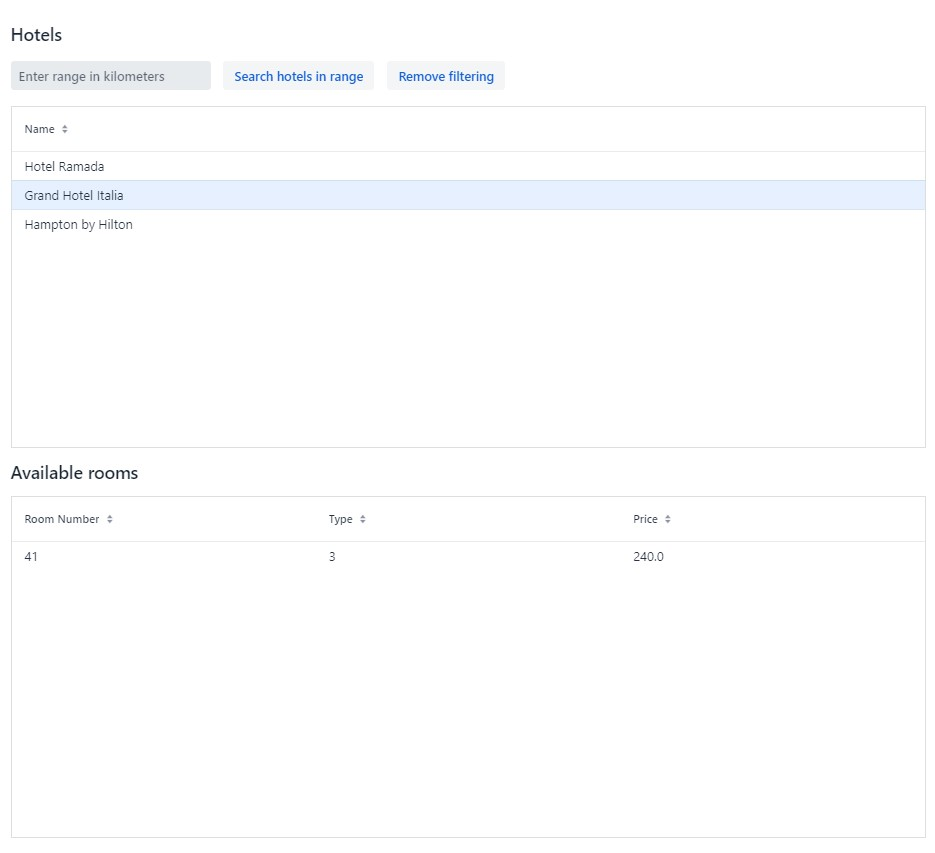
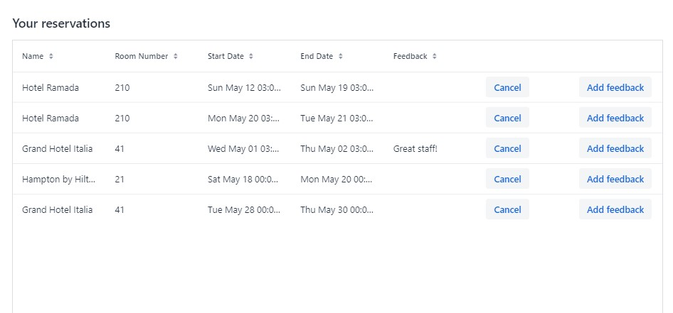

Hotel Reservation

### Table of Contents

- <a href="#overview">Overview</a>
- <a href="#instalation">Installation details</a>
- <a href="#run">Usage details</a>
    - <a href="#ui">User interface</a>
    - <a href="#api">Detailed API Reference</a>

- <a href="#techs">Technologies used</a>

<br>

## <a id="overview"></a>Overview

<b>Hotel reservation</b> is an application that manages the reservation for hotel rooms. A user can select the nearby
hotels by having with the possibility to specify the radius of searched area. He can also check the availability of the
hotel rooms and afterward he can select and book any available rooms for a period of time. The reservation is confirmed just if
there is no other reservation for the room in selected interval. The user may also cancel a reservation or modify the
room booked but at least two hours before the check-in.

<br>

## <a id="instalation"></a>Installation details

The application can be packed using gradle by running the following command:

```
gradlew clean build
```

And afterward start the application by running the jar

```
java -jar hotelreservation.jar 
```

<br>

## <a id="usage"></a>Usage details

The application can be access via UI or by directly calling the APIs.

### <a id="ui"></a>User interface

The UI can be accessed in browser via

```
http://localhost:8080/login
```

The user is able to perform the following actions:

- login
- select range for hotel searching
- select hotel and see available rooms
- select room and create reservation
- see personal reservations
- update reservation by adding feedback
- cancel reservation



 
 

<br>

### <a id="api"></a>Detailed API Reference

The user can directly call the endpoints.

| HTTP Verbs | Endpoints                         | Action                                                                                                              |
|------------|-----------------------------------|---------------------------------------------------------------------------------------------------------------------| 
| GET        | /hotels                           | Get a list with all hotels                                                                                          |
| GET        | /hotels/id                        | Get details regarding a specific hotel                                                                              |
| GET        | /hotels/latitude/longitude/radius | Get a list with all the hotels within a distance (radius) from a specific point (defined by latitude and longitude) |
| GET        | /rooms/id                         | Get all rooms for a hotel specified by id                                                                           |
| GET        | /reservations                     | Get all reservations                                                                                                |
| GET        | /reservations/user/id             | Get al reservations made by a user that is specified through id                                                     |
| POST       | /reservations                     | Create new reservation                                                                                              |
| DELETE     | /reservations/id                  | Delete reservation with specified id                                                                                |
| PUT        | /reservations/id/roomId           | Update room (specified through roomId) for a reservation (specified through id)                                     |
| PUT        | reservations/feedback/id/feedback | Update feedback for a reservation (specified through id)                                                            |
| POST       | /users/login                      | Create a new user or return existing one                                                                            |

<br>

## <a id="techs"></a>Technologies used

- **Java 17**<br> Java was used as the primary programming language for developing the backend and frontend logic of the
  project.
- **SpringBoot 3** <br> Spring Boot was utilized to create RESTful API for handling user authentication, hotels, rooms
  and reservations management.
- **SpringBoot JPA** <br> Spring Data JPA was employed to manage the persistence layer.
- **SQLite** <br> SQLite was chosen as the database management system to store application data.
- **Vaadin 20** <br> Vaadin was used to build the web-based user interface, enabling users to interact with the system
  in a more friendly way.
- **JUnit 5** <br> JUnit was user for creating tests.
- **Lombok** <br> Lombok was utilized for auto generation of getters setters and constructor for domain entities.


